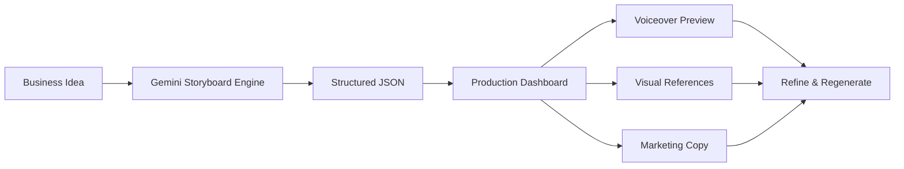

# 🎬 Marketicians — The Short-Form Production Co-Pilot

> Transform product ideas into production-ready short-form content workflows in seconds.

Marketicians is an AI-assisted content production workspace designed for small businesses, creators, and marketers who need to create TikTok, Instagram Reels, and YouTube Shorts without spending hours planning every video.

Instead of generating a finished video, Marketicians acts as an **AI Creative Director**, automatically producing a complete production blueprint including:

* Scene-by-scene storyboards
* Camera framing directions
* Voiceover scripts
* On-screen subtitles
* Marketing copy
* Visual references
* AI-generated audio previews

---

## 🚀 The Problem

Short-form content has become one of the most important channels for online growth.

Yet small businesses face three major challenges:

### ⏰ Time

Creating content requires:

* Idea generation
* Script writing
* Shot planning
* Caption creation
* Voiceover writing
* Editing preparation

A single post can consume hours before filming even begins.

### 💸 Cost

Professional content creators and agencies often charge:

* $500–$2,000 per video
* $3,000–$10,000 per month for managed services

These costs are prohibitive for many small businesses.

### 📉 Consistency

When content becomes expensive and time-consuming:

* Posting frequency decreases
* Audience growth slows
* Brand visibility declines

Marketicians was built to eliminate these bottlenecks.

---

## 💡 Solution

Marketicians transforms a simple business idea into a complete production plan.

### User Input

The user provides:

* Product or service description
* Target platform
* Desired content tone

Example:

```text
Product:
Premium Matcha Latte

Platform:
TikTok

Tone:
Fun and energetic
```

---

### AI Output

Marketicians generates:

```text
Scene 1 (0-5s)
Camera: Close-up pour shot
Voiceover:
"Watch us turn premium matcha into your new obsession."

Subtitle:
"Matcha lovers, this one's for you."
```

Along with:

* Visual references
* Marketing captions
* Content hooks
* Scene timing
* Audio previews

---

## 🏗 Architecture

### 1. Gemini Flash — Conceptual Director

Responsible for:

* Prompt interpretation
* Storyboarding
* Structured content planning
* JSON generation

The model is configured to return highly structured output rather than free-form text.

---

### 2. Gemini TTS + Web Audio API

Responsible for:

* Voiceover generation
* Audio previews
* Dynamic backing music synthesis

Allows users to preview content pacing directly in the browser.

---

### 3. Gemini Flash Image

Responsible for:

* Visual references
* Scene concept generation
* Shot composition guidance

Provides creators with a visual understanding of how each scene should be framed.

---

## 🔄 AI-First Workflow



Users can instantly regenerate content while adjusting:

* Tone
* Audience
* Style
* Trend alignment

This creates a rapid creative feedback loop.

---

## 🔐 Security

Marketicians follows a lightweight and privacy-conscious architecture.

### React Frontend

Handles:

* Storyboard rendering
* Audio playback
* User interactions

### Node.js Edge Proxy

Protects:

* API credentials
* Google Cloud keys
* Service endpoints

### Zero Persistent Storage

Currently:

* No user database
* No content retention
* Session data exists only in browser memory

---

## 🛠 Tech Stack

### Frontend

* React
* Tailwind CSS
* Web Audio API

### Backend

* Node.js
* Express

### AI Models

* Gemini Flash
* Gemini TTS
* Gemini Flash Image

### Infrastructure

* Serverless deployment
* Edge proxy architecture

---

## 📈 Roadmap

### Phase 1 ✅

Hackathon MVP

* Multi-model generation
* Storyboard dashboard
* Browser audio synthesis

### Phase 2 🚧

Infrastructure Scaling

* Secure cloud deployment
* Persistent project management
* User accounts

### Phase 3 🎯

Commercial Launch

* Subscription tiers
* Team collaboration
* Content libraries
* Enterprise tools

---

## 🎯 Vision

Our vision is to become the operating system for short-form content production.

We believe that every small business deserves access to professional creative direction without requiring an agency budget or a dedicated content team.

Marketicians transforms content creation from a creative bottleneck into a repeatable workflow—allowing businesses to focus on what they do best while AI handles the production planning process.

---

## 👥 Team

Built during HackOnVibe as an exploration of AI-assisted creative production workflows.

---

## 📄 License

This project is currently released for demonstration and research purposes.

Future licensing terms will be announced alongside commercial deployment.
